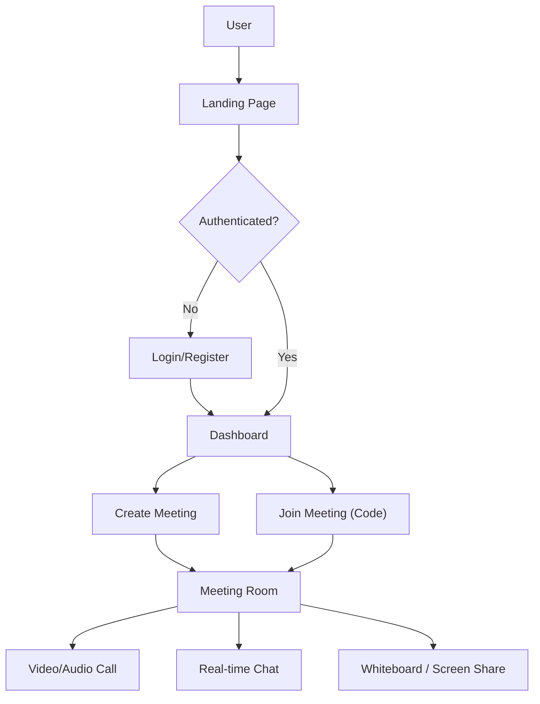

## 1. Product Overview
ConnectSphere is a full-stack real-time communication platform offering video conferencing, text chat, screen sharing, and a collaborative whiteboard.
- It solves the problem of disconnected communication tools by unifying video, chat, and collaborative spaces. Target users are remote teams, educators, and online communities.
- The market value is in providing a reliable, secure, and modern all-in-one meeting solution with a high-quality UI/UX.

## 2. Core Features

### 2.1 User Roles
| Role | Registration Method | Core Permissions |
|------|---------------------|------------------|
| Guest | None | Can join meetings via link, participate in chat/video |
| Registered User | Email & Password | Can create meetings, host controls, save profile |
| Host | Assigned on creation | Full meeting controls (kick, mute all, manage waiting room) |

### 2.2 Feature Module
1. **Landing Page**: Hero section, features overview, login/register CTA.
2. **Authentication**: Login, register, JWT token handling.
3. **Dashboard**: User profile, create meeting, join meeting, upcoming meetings.
4. **Meeting Room**: Video grid, screen share, host controls, chat sidebar, participant list.
5. **Collaborative Whiteboard**: Canvas drawing, sync via Socket.io, clear/save.

### 2.3 Page Details
| Page Name | Module Name | Feature description |
|-----------|-------------|---------------------|
| Landing Page | Hero section | Animated intro, value proposition, quick join input |
| Auth Page | Form | Email/Password inputs, error handling, redirect to dashboard |
| Dashboard | User Panel | Show user info, "New Meeting", "Join by Code" buttons |
| Meeting Room | Video Grid | WebRTC streams, self-view, responsive layout |
| Meeting Room | Sidebar | Real-time chat, participant list, whiteboard toggle |
| Whiteboard | Canvas | Real-time synced drawing tools |

## 3. Core Process
User logs in, accesses dashboard, creates or joins a meeting, and interacts in real-time.

## 4. User Interface Design
### 4.1 Design Style
- Primary and secondary colors: Deep slate background (Dark Mode default) with vibrant indigo/purple accents.
- Button style: Rounded corners (xl), subtle hover glow effects, clear primary/secondary distinctions.
- Font and sizes: Modern sans-serif (e.g., Inter or Poppins) for clean readability.
- Layout style: Sidebar navigation for dashboard, immersive full-screen for meeting room.
- Icon/emoji style suggestions: Minimalist stroke icons (Lucide React or similar).

### 4.2 Page Design Overview
| Page Name | Module Name | UI Elements |
|-----------|-------------|-------------|
| Dashboard | Main View | Card-based layout for actions, subtle glassmorphism |
| Meeting Room | Control Bar | Floating bottom bar with circular action buttons (Mute, Video, Share) |
| Meeting Room | Sidebar | Slide-out panel for Chat/Participants with dark contrast |

### 4.3 Responsiveness
Desktop-first design, fully mobile-adaptive. The meeting video grid will collapse into a vertical scroll or focused speaker view on mobile. Touch optimization for whiteboard drawing on tablets/phones.
