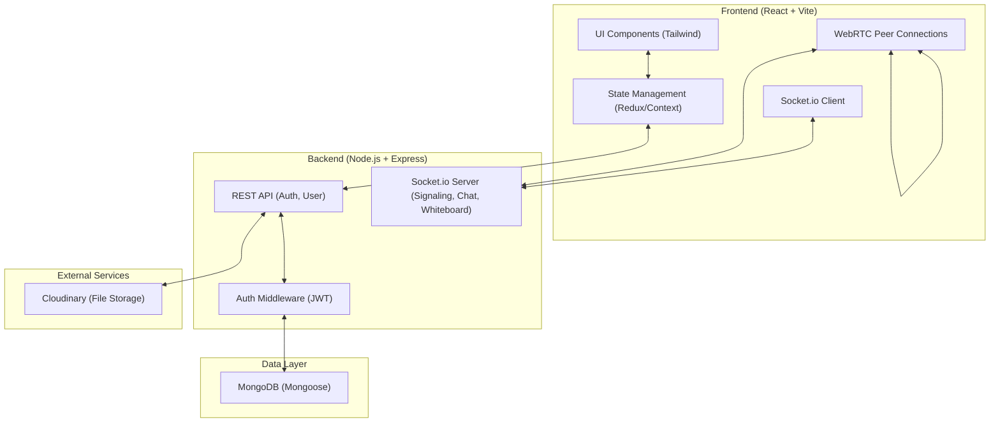
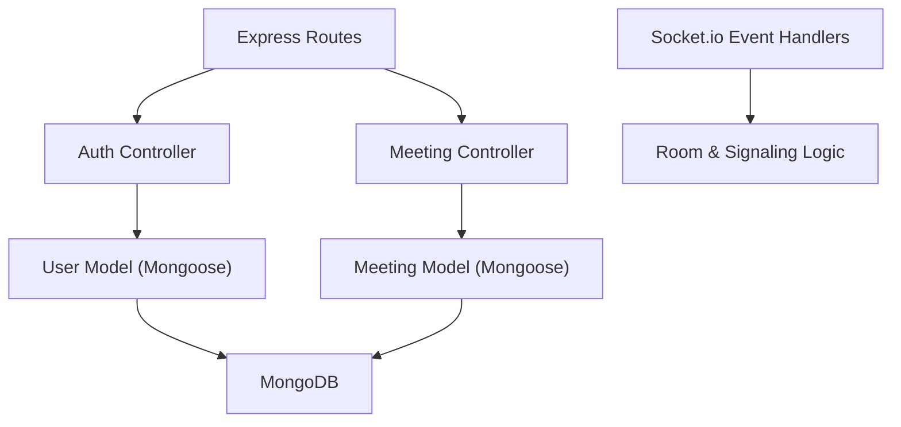
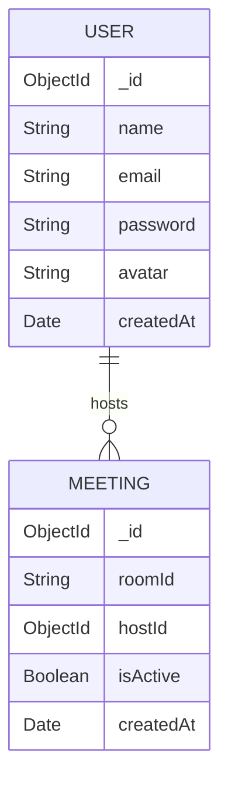

## 1. Architecture Design


## 2. Technology Description
- Frontend: React@18 + tailwindcss@3 + vite, Redux Toolkit, Framer Motion, Socket.io-client, Simple-peer (or native WebRTC).
- Backend: Node.js, Express.js, Socket.io, Mongoose, bcryptjs, jsonwebtoken, dotenv.
- Initialization Tool: vite (create-vite), npm init.
- Deployment: Vercel (Frontend), Render (Backend).

## 3. Route Definitions
| Route | Purpose |
|-------|---------|
| / | Landing Page |
| /login | User login |
| /register | User registration |
| /dashboard | User dashboard (protected) |
| /meeting/:id | Meeting room interface (protected/guest with name) |
| /profile | User profile settings (protected) |
| * | 404 Not Found Page |

## 4. API Definitions
```typescript
// POST /api/auth/register
interface RegisterRequest {
  name: string;
  email: string;
  passwordHash: string;
}
interface AuthResponse {
  token: string;
  user: { id: string; name: string; email: string };
}

// POST /api/auth/login
interface LoginRequest {
  email: string;
  passwordHash: string;
}

// GET /api/users/profile
// Headers: Authorization: Bearer <token>
```

## 5. Server Architecture Diagram


## 6. Data Model
### 6.1 Data Model Definition


### 6.2 Data Definition Language
```javascript
// Mongoose Schemas (Conceptual)
const userSchema = new mongoose.Schema({
  name: { type: String, required: true },
  email: { type: String, required: true, unique: true },
  password: { type: String, required: true },
  avatar: { type: String, default: '' }
}, { timestamps: true });

const meetingSchema = new mongoose.Schema({
  roomId: { type: String, required: true, unique: true },
  hostId: { type: mongoose.Schema.Types.ObjectId, ref: 'User' },
  isActive: { type: Boolean, default: true }
}, { timestamps: true });
```